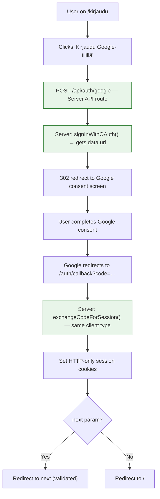

# Spec: Google OAuth Authentication

> **Parent Spec:** [`specs/auth/spec.md`](./spec.md)
> **Linear Issues:** ROO-63 (initial), ROO-88 (fix: server-initiated flow)

## 1. Blueprint (Design)

### Context
> **Goal:** One-click Google login via server-initiated OAuth, sharing the same `/auth/callback` and profile auto-creation as all other auth methods.
> **Why:** Reduces login friction — no email roundtrip, familiar UX. Complements Magic Link.
> **Architectural Impact:** Adds `POST /api/auth/google` server endpoint. Removes browser-side Supabase client from the OAuth flow entirely.

### Why Server-Initiated (ROO-88)

The original implementation (ROO-63) used a **browser-initiated** flow:

1. `GoogleLoginButton.svelte` created a `createBrowserClient` from `@supabase/ssr`
2. Browser called `signInWithOAuth()` — generating a PKCE `code_verifier` stored in a browser cookie
3. After Google consent, `/auth/callback` (server) called `exchangeCodeForSession()` using `createServerClient`

This **hybrid client approach fails in production** because the PKCE `code_verifier` cookie set by the browser client may not survive the redirect through Google back to the callback endpoint (cookie domain/path/SameSite issues between browser-set and server-read cookies).

The fix aligns with the [official Astro + Supabase guide](https://docs.astro.build/en/guides/backend/supabase/): make OAuth **server-initiated** so the same client type (`createServerClient`) handles both the PKCE initiation and the code exchange.

### Auth Flow (Server-Initiated)



> All steps are server-side (green). No browser-side Supabase client involved.

### Endpoint: `POST /api/auth/google`

```typescript
// apps/main-site/src/pages/api/auth/google.ts
import type { APIRoute } from 'astro';
import { createSupabaseServerClient } from '../../lib/supabase';

export const POST: APIRoute = async ({ request, cookies, redirect }) => {
  const supabase = createSupabaseServerClient({ request, cookies });

  const formData = await request.formData();
  const next = formData.get('next');

  // Build callback URL preserving next param
  const origin = new URL(request.url).origin;
  const callbackUrl = new URL('/auth/callback', origin);
  if (typeof next === 'string' && next.startsWith('/') && !next.startsWith('//')) {
    callbackUrl.searchParams.set('next', next);
  }

  const { data, error } = await supabase.auth.signInWithOAuth({
    provider: 'google',
    options: {
      redirectTo: callbackUrl.toString(),
    },
  });

  if (error || !data.url) {
    return redirect('/kirjaudu?error=auth_callback_failed');
  }

  return redirect(data.url);
};
```

### Component: `GoogleLoginButton.svelte`

After ROO-88, this becomes a plain HTML form — no Supabase client, no JS required:

```svelte
<form method="POST" action="/api/auth/google">
  <input type="hidden" name="next" value={next} />
  <button type="submit">
    <!-- Google icon SVG -->
    <span>{label}</span>
  </button>
</form>
```

Props simplified: only `next`, `label`, `errorLabel` — no `supabaseUrl` or `supabaseAnonKey`.

### Files

```
apps/main-site/src/
├── pages/api/auth/
│   └── google.ts                # NEW: Server-initiated OAuth (ROO-88)
├── components/
│   └── GoogleLoginButton.svelte # SIMPLIFIED: plain <form>, no Supabase client (ROO-88)
└── pages/
    └── kirjaudu.astro           # UPDATED: no longer passes Supabase keys to Google button
```

### Anti-Patterns

- **NEVER** use `createBrowserClient` for OAuth initiation — causes PKCE `code_verifier` mismatch between browser and server clients (ROO-88)
- **NEVER** pass `supabaseUrl` or `supabaseAnonKey` as props to `GoogleLoginButton` — the component no longer needs them (ROO-88)
- **NEVER** call `signInWithOAuth()` from a Svelte component — all OAuth must go through `POST /api/auth/google` (ROO-88)

---

## 2. Contract (Quality)

### Definition of Done

**Google OAuth SSR (ROO-88):**
- [ ] `POST /api/auth/google` API route handles `signInWithOAuth` server-side
- [ ] Server extracts `data.url` and returns 302 redirect to Google
- [ ] `GoogleLoginButton.svelte` simplified — no `createBrowserClient`, no Supabase keys as props
- [ ] `kirjaudu.astro` no longer passes `supabaseUrl`/`supabaseAnonKey` to Google button
- [ ] PKCE `code_verifier` handled entirely by server client (no browser/server mismatch)
- [ ] `next` parameter preserved through the full OAuth flow
- [ ] Existing `/auth/callback.ts` unchanged (shared with Magic Link)
- [ ] `pnpm biome check .` passes
- [ ] `pnpm tsc --noEmit` passes
- [ ] E2E test: Google OAuth login flow

### Regression Guardrails

- **Invariant:** `/auth/callback` remains shared by all auth methods — no provider-specific callbacks
- **Invariant:** `next` parameter validated (relative path, no `//`) at every step
- **Invariant:** No Supabase credentials exposed to client-side JavaScript for auth
- **Invariant:** Profile auto-creation trigger fires for new Google users (same as Magic Link)

### Scenarios (Gherkin)

**Scenario: Google OAuth login succeeds via server-initiated flow (ROO-88)**
- Given: User is on `/kirjaudu`
- When: User clicks "Kirjaudu Google-tilillä"
- Then: Form POSTs to `/api/auth/google`
- And: Server calls `signInWithOAuth` using the Supabase server client
- And: Server redirects (302) to Google consent screen
- When: User completes Google consent
- Then: Google redirects to `/auth/callback?code=…`
- And: Server exchanges code for session (same client type handles PKCE)
- And: Session cookies set
- And: User redirected to `next` param or `/`

**Scenario: Google OAuth login with next parameter (ROO-88)**
- Given: User navigates to `/kirjaudu?next=/admin`
- When: User clicks "Kirjaudu Google-tilillä"
- Then: `next=/admin` is included in the form POST
- And: Callback URL includes `?next=/admin`
- When: Auth completes successfully
- Then: User is redirected to `/admin`

**Scenario: Google OAuth login fails at provider (ROO-88)**
- Given: User is on `/kirjaudu`
- When: User clicks "Kirjaudu Google-tilillä"
- And: `signInWithOAuth` returns an error (or user cancels Google consent)
- Then: User is redirected to `/kirjaudu?error=auth_callback_failed`
- And: Error message shown inline

**Scenario: First-time Google OAuth user gets profile created**
- Given: User has no existing account
- When: User completes Google OAuth login
- Then: New user created in `auth.users`
- And: Profile row auto-created via DB trigger
- And: Session established

---

**Spec Status:** Live
**Created:** 2026-02-18 (extracted from `specs/auth/spec.md`)
**Linear Issues:** ROO-63, ROO-88
**Owner:** @Architect
