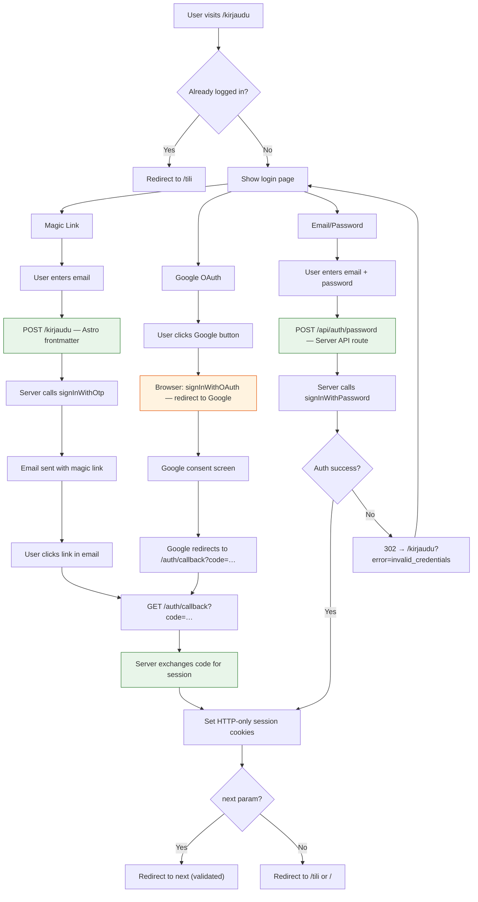

# Spec: Regular User Authentication

## 1. Blueprint (Design)

### Context
> **Goal:** Allow regular users to log in, manage their account, and request data deletion.
> **Why:** Enable future features like content suggestions, favorites, and personalized experiences while maintaining GDPR compliance.
> **Architectural Impact:** Adds `profiles` table, public auth routes (`/kirjaudu`, `/tili`, `/auth/callback`), extends middleware, and integrates with SiteHeader. Single login page for all users — no separate admin login.

### Authentication Strategy

**Providers:** Supabase Auth with Magic Link (passwordless email) + Google OAuth + Email/Password (feature-flagged)

**Single Login Page (ROO-85):**
All users (regular and admin) authenticate through `/kirjaudu`. The `next` query parameter controls post-login redirect (e.g., `/kirjaudu?next=/admin`). There is no separate admin login page — `/admin/login` redirects to `/kirjaudu?next=/admin`.

**Why Magic Link:**
- No passwords to manage or forget
- More secure (no credentials to leak)
- Simple UX: enter email → click link → logged in

**Why Google OAuth (added ROO-63):**
- One-click login, no email roundtrip
- Familiar UX for most users
- Reduces friction for new users
- Complements Magic Link (users choose preferred method)
- Both methods share the same `/auth/callback` route and profile auto-creation trigger

**Why Email/Password (added ROO-67, feature-flagged):**
- Fastest login for local development (no email roundtrip, no Google consent screen)
- Aligns dev workflow with E2E test infrastructure (`createAdminSession` and `createTestUser` already use `signInWithPassword`)
- **Gated by `PUBLIC_ENABLE_PASSWORD_LOGIN` env var** — disabled in production by default
- Uses the same session mechanism as other providers (no additional infrastructure)

**User Roles:**
| Role | Permissions | Implementation |
|------|-------------|----------------|
| `admin` | Full CRUD on all entities | Existing: `app_metadata.role = 'admin'` |
| `user` | Read-only + own profile management | Default: no `app_metadata.role` or `role = 'user'` |
| `anonymous` | Read-only public catalog | No session |

### Auth Flow

**Magic Link path:**
1. User navigates to `/kirjaudu` (or clicks "Kirjaudu" in SiteHeader)
2. User enters email → Supabase sends magic link (the `next` query param from `/kirjaudu?next=X` is forwarded into `emailRedirectTo` as `/auth/callback?next=X`)
3. User clicks link in email → redirected to `/auth/callback`
4. Callback validates `next` parameter (relative path only, no `//`)
5. Callback exchanges code for session
6. If first login: `profiles` row created via DB trigger
7. Session stored in HTTP-only cookie
8. User redirected to `next` or `/` (home)

**Google OAuth path:**
1. User navigates to `/kirjaudu`
2. User clicks "Kirjaudu Google-tilillä" button
3. `signInWithOAuth({ provider: 'google' })` redirects browser to Google consent screen
4. After consent, Google redirects to `/auth/callback` (same route as Magic Link)
5. Steps 4–8 are identical to Magic Link path above

**Email/Password path (feature-flagged, ROO-67, fixed ROO-87):**
1. User navigates to `/kirjaudu` (password form visible only when `PUBLIC_ENABLE_PASSWORD_LOGIN=true`)
2. User enters email + password and submits `<form method="POST" action="/api/auth/password">`
3. Server-side API route calls `signInWithPassword({ email, password })` using the Supabase server client
4. On success: server sets session cookies and returns 302 redirect to `next` param or `/tili`
5. On error (invalid credentials, unconfirmed email): server redirects back to `/kirjaudu?error=invalid_credentials`, error message shown inline, form remains visible for retry

### Login Flow Diagram



> **Legend:** Green = server-side auth (SSR). Orange = browser-initiated redirect (legitimate OAuth exception).

### Data Architecture

**New Table: `profiles`**

```sql
CREATE TABLE profiles (
  id UUID PRIMARY KEY REFERENCES auth.users(id) ON DELETE CASCADE,
  display_name TEXT,
  created_at TIMESTAMPTZ NOT NULL DEFAULT now(),
  updated_at TIMESTAMPTZ NOT NULL DEFAULT now()
);

-- Auto-create profile on user signup
CREATE OR REPLACE FUNCTION handle_new_user()
RETURNS TRIGGER AS $$
BEGIN
  INSERT INTO profiles (id)
  VALUES (NEW.id);
  RETURN NEW;
END;
$$ LANGUAGE plpgsql SECURITY DEFINER;

CREATE TRIGGER on_auth_user_created
  AFTER INSERT ON auth.users
  FOR EACH ROW EXECUTE FUNCTION handle_new_user();
```

**RLS Policies:**

```sql
-- Users can read their own profile
CREATE POLICY "Users can view own profile"
  ON profiles FOR SELECT
  USING (auth.uid() = id);

-- Users can update their own profile
CREATE POLICY "Users can update own profile"
  ON profiles FOR UPDATE
  USING (auth.uid() = id)
  WITH CHECK (auth.uid() = id);

-- Admins have full access (SELECT, INSERT, UPDATE, DELETE)
CREATE POLICY "Enable write access for admins"
  ON profiles FOR ALL
  USING ((auth.jwt() -> 'app_metadata' ->> 'role') = 'admin')
  WITH CHECK ((auth.jwt() -> 'app_metadata' ->> 'role') = 'admin');
```

**Zod Schema:**

```typescript
// packages/database/src/schemas/core.ts
import { z } from 'zod';

export const ProfileSchema = z.object({
  id: z.string().uuid(),
  display_name: z.string().max(100).nullable(),
  created_at: z.string().datetime(),
  updated_at: z.string().datetime(),
});

export type Profile = z.infer<typeof ProfileSchema>;
```

### UI Architecture

#### Routes

```
/kirjaudu              → Single login page for all users (Magic Link, Google OAuth, Password)
/auth/callback         → Token exchange (shared for all users)
/tili                  → Account page (requires auth)
/api/auth/password    → Password login endpoint (POST, SSR — ROO-87)
/api/auth/delete       → Account deletion endpoint (POST)
/admin/login           → 301 redirect to /kirjaudu?next=/admin (DEPRECATED, ROO-85)
```

#### Components

**Modified:**
- `SiteHeader.astro` - Conditional login/logout button + user display

**New:**
- `apps/main-site/src/pages/kirjaudu.astro` - Login form
- `apps/main-site/src/pages/auth/callback.ts` - Auth callback
- `apps/main-site/src/pages/tili.astro` - Account page
- `apps/main-site/src/pages/api/auth/delete.ts` - Deletion API

#### Data Flow

```
SiteHeader (SSR)
  ↓
Check session via supabase.auth.getUser()
  ↓
If not logged in: show "Kirjaudu" link
If logged in: show display_name + logout link
  ↓
If logged in AND app_metadata.role === 'admin': also show "Ylläpito" link → /admin
```

### Account Deletion Flow

1. User navigates to `/tili`
2. User clicks "Poista tili" (Delete account)
3. Confirmation modal appears
4. User confirms by clicking confirm button in modal
5. POST to `/api/auth/delete`
6. Server deletes user from `auth.users` (cascades to `profiles`)
7. Session cleared
8. User redirected to `/` with success message

### File Structure

```
apps/main-site/src/
├── pages/
│   ├── kirjaudu.astro          # Single login page (all users)
│   ├── tili.astro              # Account management
│   ├── admin/
│   │   └── login.astro         # DEPRECATED: 301 redirect to /kirjaudu?next=/admin (ROO-85)
│   ├── auth/
│   │   └── callback.ts         # Shared auth callback
│   └── api/
│       └── auth/
│           ├── password.ts    # Password login (POST, SSR — ROO-87)
│           └── delete.ts       # Account deletion
├── middleware.ts               # Protects /admin/* and /tili, redirects to /kirjaudu
└── components/
    ├── PasswordLoginForm.svelte  # Plain <form>, no Supabase client (ROO-87)
    └── SiteHeader integration    # Conditional auth UI
```

**Removed (ROO-85):**
- `apps/main-site/src/pages/admin/auth/callback.ts` — Legacy admin callback, superseded by `/auth/callback`

### Feature Flags

| Flag | Type | Default | Purpose |
|------|------|---------|---------|
| `PUBLIC_ENABLE_PASSWORD_LOGIN` | `boolean` | `false` | Gates email/password login form visibility on `/kirjaudu` |

**Astro access pattern:** Astro exposes `PUBLIC_`-prefixed env vars to both server and client via `import.meta.env.PUBLIC_ENABLE_PASSWORD_LOGIN`. The flag is read in `kirjaudu.astro` frontmatter and passed as a prop to conditionally render the password form component.

**Convention:** Feature flags use the `PUBLIC_ENABLE_` prefix when they affect client-visible UI. Server-only flags (e.g., for API behavior) use the `ENABLE_` prefix without `PUBLIC_`.

### Anti-Patterns

- **NEVER** use `user_metadata` for role checks (user-modifiable)
- **NEVER** expose user email publicly (privacy)
- **NEVER** allow deletion without confirmation
- **NEVER** skip `next` parameter validation (open redirect prevention)
- **NEVER** fetch user data client-side in Svelte (use Astro SSR)
- **NEVER** use `createBrowserClient` for `signInWithPassword` — this bypasses server cookie handling and breaks SSR auth context (ROO-87)
- **NEVER** pass Supabase URL or anon key as props to Svelte components for auth purposes — only OAuth components (which require browser redirect) are the legitimate exception
- **NEVER** create separate login pages per role — use `/kirjaudu` with `next` param (ROO-85)

---

## 2. Contract (Quality)

### Definition of Done

**Database:**
- [ ] `profiles` table created with proper constraints
- [ ] RLS policies applied (own profile read/update, admin read all)
- [ ] Trigger for auto-profile creation on signup
- [ ] Zod schema in `@roolipeli/database`
- [ ] Types regenerated via `supabase gen types`

**Public Login (`/kirjaudu`):**
- [ ] Magic Link email sent on form submit
- [ ] Success message shown after submission
- [ ] Error handling for invalid email
- [ ] Redirect to `next` param after login (if provided)
- [ ] Already logged-in users redirected to `/tili`

**Auth Callback (`/auth/callback`):**
- [ ] Exchanges code for session
- [ ] Validates `next` param (relative path, no `//`)
- [ ] Redirects to `next` or `/` on success
- [ ] Redirects to `/kirjaudu?error=...` on failure

**Account Page (`/tili`):**
- [ ] Protected by middleware (redirects to `/kirjaudu` if not logged in)
- [ ] Shows user email and display_name
- [ ] Allows updating display_name
- [ ] Shows "Poista tili" button
- [ ] Shows account creation date

**Account Deletion:**
- [ ] Requires confirmation
- [ ] Deletes user from `auth.users` (cascades profile)
- [ ] Clears session
- [ ] Redirects to `/` with success message

**SiteHeader Integration:**
- [ ] Shows "Kirjaudu" link when not logged in
- [ ] Shows user display_name (or email fallback) when logged in
- [ ] Shows logout link when logged in
- [ ] Shows "Ylläpito" link to `/admin` when user has `app_metadata.role === 'admin'` (ROO-70)

**Unified Login (ROO-85):**
- [ ] `/admin/login` returns 301 redirect to `/kirjaudu?next=/admin`
- [ ] `/admin/auth/callback` removed (legacy, unused)
- [ ] Middleware redirects unauthenticated admin users to `/kirjaudu?next=/admin` (not `/admin/login`)
- [ ] Middleware no longer exempts `/admin/login` from auth checks
- [ ] E2E tests updated: admin auth tests use `/kirjaudu` flow

**Password Login SSR (ROO-87):**
- [ ] `POST /api/auth/password` API route handles `signInWithPassword` server-side
- [ ] `PasswordLoginForm.svelte` is a plain `<form>` — no `createBrowserClient`, no Supabase client
- [ ] No Supabase URL or anon key passed as props to the password form component
- [ ] Session cookies set by server, redirect via 302
- [ ] Error case redirects to `/kirjaudu?error=invalid_credentials`
- [ ] `next` parameter validated (relative path, no `//`) before redirect
- [ ] E2E test: password login → session → redirect to account page

**Quality:**
- [ ] `pnpm biome check .` passes
- [ ] `pnpm tsc --noEmit` passes
- [ ] No `any` types
- [ ] All forms use Zod validation
- [ ] E2E tests for all scenarios

### Regression Guardrails

- **Invariant:** Admin routes remain protected (no regression from public auth)
- **Invariant:** `app_metadata.role` is authoritative for permissions
- **Invariant:** Session cookies are HTTP-only
- **Invariant:** Open redirect prevention on all callback URLs

### Scenarios (Gherkin)

**Scenario: User logs in for the first time**
- Given: User has no existing account
- When: User navigates to `/kirjaudu`
- And: User enters email and submits
- Then: "Check your email" message shown
- When: User clicks magic link in email
- Then: New user created in `auth.users`
- And: Profile row auto-created via trigger
- And: Session cookie set
- And: User redirected to `/`

**Scenario: Returning user logs in**
- Given: User has existing account
- When: User enters email on `/kirjaudu`
- And: Clicks magic link
- Then: Session established
- And: Redirected to `/` (or `next` param)

**Scenario: User views account page**
- Given: User is logged in
- When: User navigates to `/tili`
- Then: Page shows email and display_name
- And: Shows account creation date
- And: Shows "Update" and "Delete" options

**Scenario: User updates display name**
- Given: User is on `/tili`
- When: User changes display_name to "Matti M."
- And: Submits form
- Then: Profile updated in database
- And: Success message shown

**Scenario: User deletes account**
- Given: User is on `/tili`
- When: User clicks "Poista tili"
- Then: Confirmation modal appears
- When: User confirms deletion
- Then: User deleted from `auth.users`
- And: Profile cascaded (deleted)
- And: Session cleared
- And: Redirected to `/` with success message

**Scenario: Login fails due to Supabase error**
- Given: User is on `/kirjaudu`
- When: User submits email and `signInWithOtp` returns an error
- Then: Error message is shown on the page
- And: Form remains visible for retry

**Scenario: Unauthenticated user tries to access /tili**
- Given: User is not logged in
- When: User navigates to `/tili`
- Then: Redirected to `/kirjaudu?next=/tili`

**Scenario: Password login succeeds (ROO-87)**
- Given: `PUBLIC_ENABLE_PASSWORD_LOGIN=true` is set
- And: User has a valid account with email and password
- When: User enters credentials on `/kirjaudu` and submits
- Then: Form POSTs to `/api/auth/password`
- And: Server calls `signInWithPassword` using the Supabase server client
- And: Server sets session cookies
- And: User is 302-redirected to `next` param or `/tili`

**Scenario: Password login fails with invalid credentials (ROO-87)**
- Given: `PUBLIC_ENABLE_PASSWORD_LOGIN=true` is set
- And: User enters wrong email or password on `/kirjaudu`
- When: User submits the password form
- Then: Server redirects to `/kirjaudu?error=invalid_credentials`
- And: Error message is shown inline on the login page
- And: Form remains visible for retry

**Scenario: User sees loading state during login**
- Given: User is on `/kirjaudu`
- When: User submits email
- And: Network request is pending
- Then: Submit button is disabled
- And: Loading spinner is visible

**Scenario: User sees specific error code from Supabase**
- Given: User is on `/kirjaudu`
- When: User submits email
- And: Supabase returns 429 (Rate Limit)
- Then: Page shows "Too many requests, try again later"

**Scenario: SiteHeader shows login state**
- Given: User is not logged in
- When: User views any page
- Then: SiteHeader shows "Kirjaudu" link
- Given: User is logged in
- When: User views any page
- Then: SiteHeader shows display_name and logout link

**Scenario: SiteHeader shows admin link for admin users (ROO-70)**
- Given: User is logged in with `app_metadata.role = 'admin'`
- When: User views any public page
- Then: SiteHeader shows "Ylläpito" link pointing to `/admin`

**Scenario: SiteHeader hides admin link for regular users (ROO-70)**
- Given: User is logged in without admin role
- When: User views any public page
- Then: SiteHeader does NOT show "Ylläpito" link

**Scenario: Admin login page redirects to unified login (ROO-85)**
- Given: User navigates to `/admin/login`
- Then: User is 301-redirected to `/kirjaudu?next=/admin`

**Scenario: Unauthenticated admin route access redirects to unified login (ROO-85)**
- Given: User is not logged in
- When: User navigates to `/admin/products`
- Then: User is redirected to `/kirjaudu?next=/admin`
- When: User logs in successfully
- Then: User is redirected to `/admin` (via `next` param)

---

## 3. Implementation Notes

### Middleware (updated ROO-85)

```typescript
// Protect /admin routes — redirect to unified login
if (url.pathname.startsWith('/admin')) {
  // /admin/login is now a redirect page, not exempted from auth
  // /admin/logout is allowed through
  if (url.pathname === '/admin/logout') return next();

  const supabase = createSupabaseServerClient(context);
  const { data: { user } } = await supabase.auth.getUser();
  const isAdmin = user?.app_metadata?.role === 'admin';

  if (!user || !isAdmin) {
    return redirect('/kirjaudu?next=/admin');
  }
}

// Protect /tili route
if (url.pathname === '/tili') {
  const supabase = createSupabaseServerClient(context);
  const { data: { user } } = await supabase.auth.getUser();

  if (!user) {
    return redirect(`/kirjaudu?next=${encodeURIComponent(url.pathname)}`);
  }
}
```

### Shared Callback Logic

The `/auth/callback` route handles all logins (regular users and admins):
- Validates `next` parameter (relative path, no `//`)
- Exchanges code for session
- Redirects to `next` or `/` on success

### Account Deletion with Supabase Admin

```typescript
// /api/auth/delete.ts
import { createClient } from '@supabase/supabase-js';

const supabaseAdmin = createClient(
  import.meta.env.SUPABASE_URL,
  import.meta.env.SUPABASE_SERVICE_ROLE_KEY
);

// Delete user (cascades to profiles via FK)
await supabaseAdmin.auth.admin.deleteUser(userId);
```

### i18n Keys

```typescript
// New translation keys needed:
'nav.login': 'Kirjaudu',
'nav.logout': 'Kirjaudu ulos',
'nav.account': 'Tili',
'account.title': 'Tilisi',
'account.email': 'Sähköposti',
'account.displayName': 'Näyttönimi',
'account.createdAt': 'Tili luotu',
'account.update': 'Päivitä',
'account.delete': 'Poista tili',
'account.deleteConfirm': 'Haluatko varmasti poistaa tilisi?',
'account.deleteSuccess': 'Tilisi on poistettu.',
'login.title': 'Kirjaudu sisään',
'login.emailSent': 'Kirjautumislinkki lähetetty!',
'login.error': 'Virhe kirjautumisessa',
'nav.admin': 'Ylläpito',          // SV: 'Administrera', EN: 'Admin'
```

---

## 4. Dependencies & Constraints

### Existing Dependencies (No New)
- `@supabase/ssr` - Already in use for admin auth
- `@supabase/supabase-js` - Already in use

### Constraints
- **SSR Required:** Auth pages must be server-rendered
- **Cookie-based Auth:** JWT in HTTP-only cookie (existing pattern)
- **GDPR Compliance:** Account deletion must be complete and immediate

---

## 5. Related Specs

- `specs/admin-ui/spec.md` - Admin authentication (related patterns)
- `specs/design-system/layout-and-navigation.md` - SiteHeader integration
- `specs/testing-strategy.md` - Overall testability and infrastructure strategy

---

**Spec Status:** Live
**Created:** 2026-02-04
**Updated:** 2026-02-17 (ROO-87: fix password login to SSR, add Mermaid login flow chart)
**Linear Issues:** ROO-30, ROO-85, ROO-87
**Owner:** @Architect
